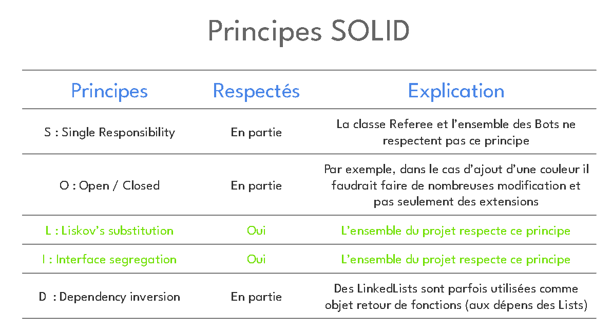
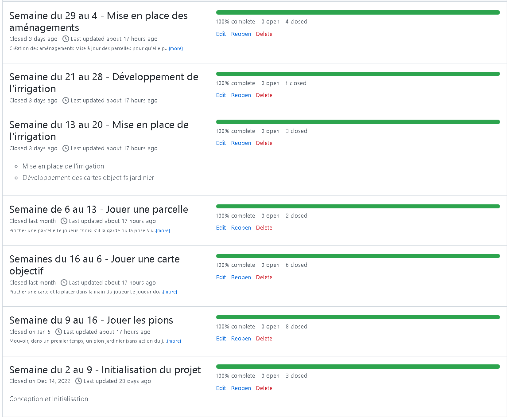
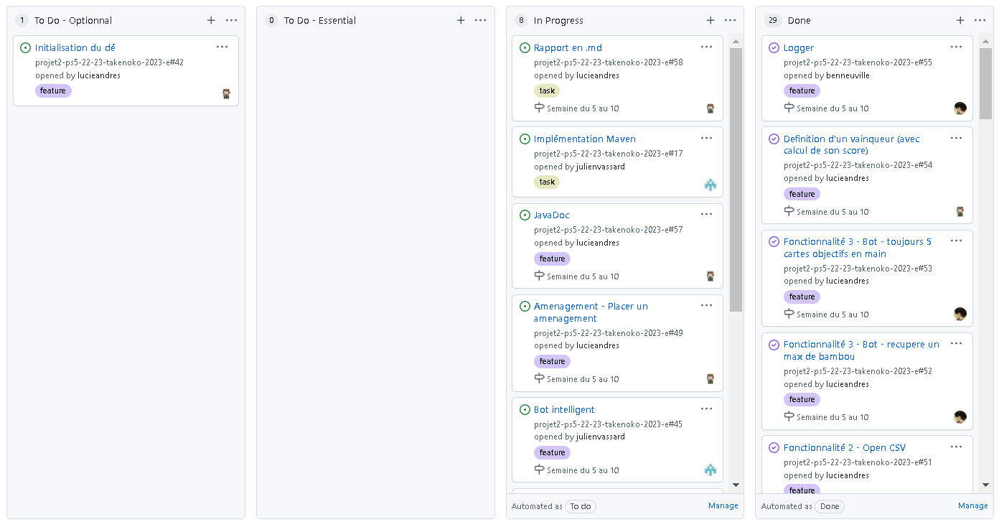
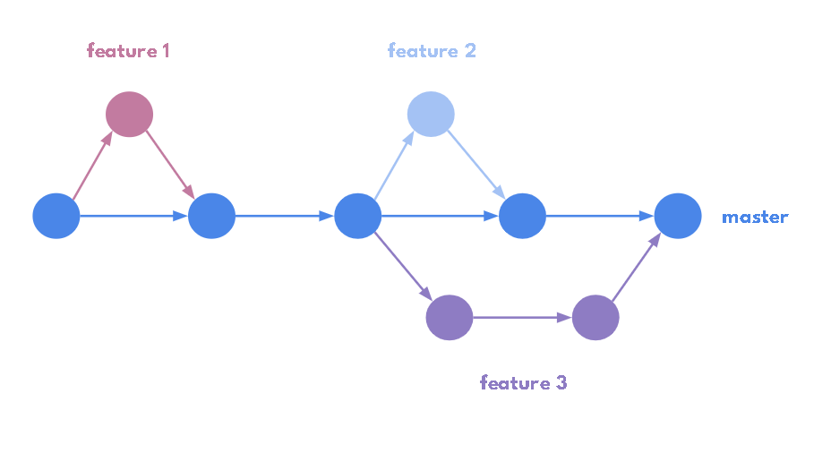

<ol>

POINT D’AVANCEMEMENT
=
  
 
  

FONCTIONNALITES
-

 

**Réalisées :**
- Le plateau (etang, parcelles de couleur, irrigation)
- Les pions (panda, jardinier et leur déplacement/action)
- Les aménagements (certaines parcelles en possèdent, cela impacte le fonctionnement
du jeu)
- Les cartes (panda, jardinier, empereur)
- Un bot Min et Max

 

**Manquantes ou partielles:**
- Le dé météorologique
- Le joueur ne peut pas poser un aménagement actuellement, seulement les parcelles
peuvent être créées initialement avec un aménagement de base
- La carte objectif parcelle est utilisable mais les bots ne l'utilise pas.
- Le bot MVP et les cartes objectifs parcelles sont dans une version non stable.

 

LOGS
-
 

Lorsque l’on lance la compilation Maven avec l’argument “--demo”, celui-ci commence une partie avec tous les logs de la partie. Les logs sont toutes les décisions des bots (piocher une carte, poser un plot, déplacer un pions, etc). Il y a aussi un affichage du plateau de jeu pour voir les parcelles placées avec leur aménagement, nombre de bambous et irrigation. Il y aussi l’affichage des logs fait par le jeu (Affichage du nouveau tour, affichage du dernier tour, affichage du nombre d’action par tour et l’affichage du gagnant avec son score.)
Quand on compile la partie avec les arguments “--csv” ou “--2thousands”, il n’y a aucun log de partie qui est affiché et seulement le résultat des bots pour les 2000 parties et la confirmation de l’écriture sur le fichier csv (pour l’écriture du fichier csv).

 

CSV
-

 

Grâce à la compilation Maven avec l'argument “--csv”, le programme génère un fichier CSV si le fichier n’est pas encore créé, s'il est déjà créé celui-ci est mis à jour avec les nouvelles statistiques qui s’additionnent avec les anciennes.
 
Le fichier .csv se trouve dans le répertoire "/stats" sous le nom de "gamestats.csv".

 
  
Le fichier contient :
  - le nombre de partie jouée
  - le nom des bots avec leur nombre de victoires, le pourcentage de victoire.
  - Le nombre de parties où il y eu une égalité.

 

BOT
-

 

Nous avons pour l'instant 3 bots dans le projet. Un bot random, qui effectue chaque action de manière totalement aléatoire.
Deux bots “intelligents”, BotMax et BotMin, ils font des actions de manière structurée et intelligente. La différence entre les deux : Le BotMax favorise les cartes objectifs dites “difficiles” donc celles qui rapportent le plus de points. Quant au BotMin, il favorise les cartes "facile" à jouer donc celles qui rapportent le moins de points.
  
Chaque bot, effectue bien deux actions par tour par contre il peut effectuer deux actions similaires le même tour.
Pour la partie déplacement de pion nous avons considéré (comme ce n’était pas écrit dans les règles) que les bots peuvent déplacer un pion sur la même case pour réeffectuer l’action du pion (ceci coûte une action quand même).
  
Nous avons commencé à implementer un 4eme bot : le BotMVP, qui comme demandé, maximise la récolte de bambous et pioche le nombre maximum de cartes objectifs. Il essaye d'effectuer deux objectifs en même temps, cependant il ne fait pas l’option d'espionner les autres bot et agir en conséquence.
  
Cependant, le botMVP n'étant pas du tout stable, nous ne l'avons pas implémenté dans la branche Master.
  
 
  
ARCHITECTURE DU PROJET
-

 

Nous avons décomposé le projet en 10 packages :

 

|    Package    |                                                                Classe                                                                 | Description                                                                                                                                                                                                                                                                                                                |
|:-------------:|:-------------------------------------------------------------------------------------------------------------------------------------:|:---------------------------------------------------------------------------------------------------------------------------------------------------------------------------------------------------------------------------------------------------------------------------------------------------------------------------|
|     Board     |                                 Board BoardGenerator PoseablePlacePlot Row RowComparator                                  | Board est une liste de Row BoardGenerator peut générer différents types de plateau selon nos besoins PoseablePlacePlot est une collection de coordonnées auxquelles ils est possible de placer une parcelle Row est une liste de Plot RowComparator permet de comparer 2 Row en fonction de leur numéro.   |
|     Card      | CardEmperor CardGenerator CardObjective CardObjectiveGardener CardObjectivPanda CardObjectivePlot PatternPlots | CardObjective est une interface CardObjectiveGarderner, CardObjectivePanda, cardObjectivePlot et CardEmperor implémente l'interface CardGenerator génére les pioches de cartes objectifs PatternPlot est une énumérationd es différentes figures que l'on peut retrouver dans les cartes objectives parcelles. |
|   (*Dice*)    |                             Cloud Dice Face Interrogation Rain Storm Sun Wind                             | Le dé météorologique n'a pas été fini dans les temps, nous avions pensé à faire un Dé ayant 6 Faces. Face serait une interface implémentée par Cloud, Interrogation, Rain, Storm, Sun et Wind                                                                                                                          |
|  Irrigation   |                                            IrrigableCoordinates IrrigableCoordinateSet                                            | IrrigableCoordinates stocke un jeu de 2 coordonnées (ainsi que la direction) entre lesquelles on peut placer une irrigation IrrigableCoordinatesSet est une collection de IrrigableCoordinates                                                                                                                         |
|    Object     |      Bamboo BambooGenerator Improvement Improvement ImprovementGenerator ImprovementType ObjectPoseable       | ObjectPoseable est une classe abstraite représentant les objets plaçables sur les parcelles. Bamboo et Improvement sont des ObjectsPoseable. Improvement possède un type parmi ceux énumérés dans ImprovementType. BambooGenerator et ImprovementGenerator génèrent les pioces de bambous et aménagements.     |
|     Pawn      |                      Gardener Panda Gardener                                                                                  | Pawn est une classe abstraite représentant les pions pouvant se déplacer sur le plateau. Panda et Gardener sont des Pawn                                                                                                                                                                                               |
|    Player     |                                           Bot Player PlayerGenerator RandomBot                                            | Player est une classe abstraite. RandomBot, Bot et BotMVP sont des Players. PlayerGenerator génère des joueurs pour nos parties.                                                                                                                                                                                       |
|     Plot      |                      Etang Plot PlotColor PlotColorGenerator PlotComparator PlotUtiliesTools                      | Etang est un Plot Plot représente une parcelle PlotColor est un Plot PlotGenerator génère la pioche de parcelles PlotComparator permet de comparer 2 parcelles en fonction de leurs coordonnées. PlotUtilitiesTools est un regroupement de méthode utilisées par plusieurs classes                     |
| Startingpoint |               DemoFormatter DemoLogger Main PlayerResultContainer Referee DataGame DataGamePlayer Game              | DemoFormatter et DemoLogger sont utilisés pour nos log.  Main est la classe de lancement du jeu.  Referee correspond à la passerelle entre le plateau et les joueurs. Game permet de lancer une partie. PlayerResultContainer, DataGame et DataGamePlayer sont des classes de stockage de données, utile pour le csv et les 2 milles parties.                                                                                                                                                                                                                                                                                                                       |
|   Utilities   |                                                  Color Coordinate Direction                                                   | Color est une énumération des couleurs que l'on retrouve dans le jeu Coordinate est composée d'un X et d'un Y Direction est une énumération des différente directions de notre plateau de jeu (6 directions)                                                                                                       |

 

Nous avons été menés à réaliser le projet ainsi pour respecter au maximum les principes SOLID. Chacun des choix de conceptions a été fait dans l’objectif de réaliser un projet évolutif et maintenable.

 

 

JAVADOC
-

 

La JavaDoc a bien été renseignée et générée, elle est trouvable dans le dossier javadoc à la base du projet.

 

ETAT DE LA BASE DU CODE
-

 

Nous avons deux grosses parties du code que l’on doit refactorer. La première partie est au niveau du code du bot, qui utilise beaucoup de code dupliqué. On peut remédier à ceci en utilisant plus de méthodes. Cependant les méthodes doivent être très générales pour pouvoir les utiliser dans tous les cas possible.
Avec l’analyse SONAR, on peut bien mettre en évidence ces codes dupliquer ainsi que la dette technique. L’analyse SONAR avant l’implémentation du bot montrait une dette technique de 2,6 jours et un pourcentage de duplication de 0,5%. Après l’implémentation la dette technique est passé à 5,6 jours (soit 3 jours en plus) et un pourcentage de duplication de 2,3%.

 

ORGANISATION
-

 

|       Lucie Andres       |     Thomas Fouassier     |  Benjamin Neuville  |           Julien Vassard           |
|:------------------------:|:------------------------:|:-------------------:|:----------------------------------:|
| Pions Panda et Jardinier |        Parcelles         | Plateau + Parcelles | Cartes objectif Panda et Jardinier |
|       Amenagements       | Cartes objectif Parcelle |     Irrigation      |             Bot Random             |
|      Carte Empereur      |           CSV            |         Log         |             Bot Smart              |
|         JavaDoc          |                          |     JCommander      |              Rapport               |
|          Tests           |                          |         CSV         |                                    |
|   Powerpoint + Rapport   |                          |       Bot MVP       |                                    |
|   (Dé météorologique)    |                          |     Refactoring     |                                    |

 

UTILISATION DU GIT
-
 

**Milestones** : Nous avons respecté le principe d’une release par semaine, et donc d’une milestone par semaine.

 

 

**Issues** : Nous avons organisé notre projet selon le tableau d’avancement suivant. Il nous a permis d’organiser nos issues en les attribuants aux membre de notre équipe. Chaque commit a bien été lié à au moins une de ces issues. Chaque issue est bien rattachée à une unique milestone, lorsqu’elle n’était pas finie à l’issue d’une milestone, elle était reportée à la milestone suivante.

 

 

**Git branching Strategy** : Nous avons adopté la strategie de Github Flow.  Cela nous a semblé être la méthode la plus simple à mettre en place pour nous. Même si cela a parfois pu causer quelques conflits au moment des merge (principalement au niveau du Referee).  Pour essayer d’avoir tout de même une branche master la plus stable possible, nous avons toujours utiliser des Pull Request au moment des merge.

 

</ol>
